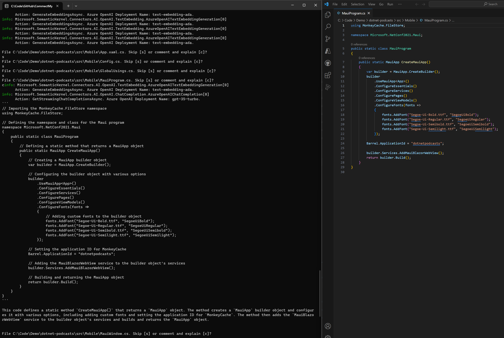

# CommectMyCode
Console app that explains and comments existing source code using Semantic Kernel and Azure OpenAI Services

## Prerequisites

- [.NET 8](https://dotnet.microsoft.com/download/dotnet/8.0) is required to run this sample.
- Install the recommended extensions
- [C#](https://marketplace.visualstudio.com/items?itemName=ms-dotnettools.csharp)
- [Semantic Kernel Tools](https://marketplace.visualstudio.com/items?itemName=ms-semantic-kernel.semantic-kernel) (optional)

## Configuring the sample

The sample can be configured by using the command line with .NET [Secret Manager](https://learn.microsoft.com/en-us/aspnet/core/security/app-secrets) to avoid the risk of leaking secrets into the repository, branches and pull requests.
This sample has been tested with the following models:

| Service      | Model type      | Model            |
| ------------ | --------------- | ---------------- |
| Azure OpenAI | Chat Completion | gpt-3.5-turbo    |
| Azure OpenAI | Embedding       | text-embedding-ada|

### Using .NET [Secret Manager](https://learn.microsoft.com/en-us/aspnet/core/security/app-secrets)

Configure an Azure OpenAI

Supporting Azure infrastructure can be deployed manually in Azure Portal or using [Azure Developer CLI](https://learn.microsoft.com/en-us/azure/developer/azure-developer-cli/install-azd?tabs=winget-windows%2Cbrew-mac%2Cscript-linux&pivots=os-windows):

```console

azd auth login

azd provision

azd down

```

Created infrastructure resources are used for Azure OpenAI Services in code:

```powershell
cd CommentMyCode

dotnet user-secrets set "AzureOpenAI:Endpoint" ">>>YOUR ENDPOINT<<<.openai.azure.com/"
dotnet user-secrets set "AzureOpenAI:ModelType" "gpt-35-turbo"
dotnet user-secrets set "AzureOpenAI:ChatCompletionModel" "gpt-3.5-turbo"
dotnet user-secrets set "AzureOpenAI:EmbeddingModel" "text-embedding-ada"
dotnet user-secrets set "AzureOpenAI:ApiKey" ">>>YOUR API KEY<<<"

```

## Key concepts

This example uses Semantic Kernel, text memory with a logger, a volatile memory store, and Azure OpenAI Text Embedding Generation Service. It imports a native function from the CodeFileFinderPlugin that finds all C# code files in the directory. Main interaction is through a chat with the AI, where the AI's role as an expert in explaining programming languages and providing valuable comments to the code.

To comment and explain source code other than C# update the `CodeFileFinderPlugin` line 16 with extension of the files you want to comment.


## Running the sample

After configuring the sample, to build and run the console application just hit `F5`.

To build and run the console application from the terminal use the following commands:

```powershell
dotnet build
dotnet run
```


When the application runs, it will prompt the user to enter a directory path. The application will then search for all C# code files in the directory and subdirectories.

> [!WARNING]  
> There is cost associated with using Azure OpenAI Services. Please review the pricing and limits before running this sample.

For each code file, it prompts the user to either skip (s) the file or comment (c) and explain the file.

```console
Specify directory with code to comment:
C:\Code\Demo\dotnet-podcast
```

Sample output shwos console output with code comments on the left and input source file on the right



## Sources

- [Demystifying Retrieval Augmented Generation with .NET](https://devblogs.microsoft.com/dotnet/demystifying-retrieval-augmented-generation-with-dotnet/)
- [Native Functions samples in Sematic Kernel for .NET](https://github.com/MicrosoftDocs/semantic-kernel-docs/tree/main/samples/dotnet/07-Simple-Native-Functions)